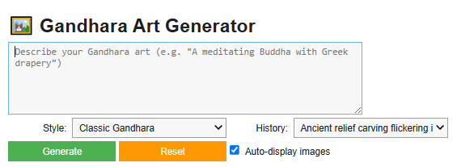

# 🖼️ Gandhara Art Generator

A powerful tool for generating stunning Gandhara-style avatars and sculptures using **Stable Diffusion**. This project combines deep learning with cultural heritage to recreate ancient art aesthetics using modern AI.

## 📌 Project Highlights

- 🎨 **Generate Avatars in Gandhara Art Style**  
  Use natural language prompts to generate highly detailed images inspired by the Greco-Buddhist art of ancient Taxila and Gandhara.

- ⚙️ **Stable Diffusion Model**  
  Uses `runwayml/stable-diffusion-v1-5` via Hugging Face's `diffusers` library for text-to-image generation.

- 🖥️ **GPU Accelerated (if available)**  
  Leverages CUDA-enabled GPU for fast generation. Compatible with Google Colab.

- 💡 **Prompt Engineering Support**  
  Includes style presets (e.g., Classic Gandhara, Ancient Relief, Cyber Gandhara) and prompt expansion features.

- 🧑‍🎨 **Interactive Colab GUI**  
  An enhanced interface using `ipywidgets` for easy use in Google Colab with support for prompt history and auto display.

---

## 🧠 Model Details

- **Base Model:** [`runwayml/stable-diffusion-v1-5`](https://huggingface.co/runwayml/stable-diffusion-v1-5)  
- **Framework:** [🤗 Hugging Face Diffusers](https://github.com/huggingface/diffusers)  
- **License:** The model is under the CreativeML Open RAIL-M license.  
  🔐 *Please make sure you have accepted the model license on Hugging Face to use it.*

---

## 🛠️ Setup Instructions

### 🔗 Requirements

- Python 3.8+
- PyTorch
- diffusers
- transformers
- PIL
- ipywidgets (for Colab GUI)

### 📦 Install Dependencies

pip install torch torchvision torchaudio --index-url https://download.pytorch.org/whl/cu118

pip install diffusers transformers accelerate pillow ipywidgets

---

## 📁 Folder Structure

📂 gandhara-art-generator/

│

├── main_script.py                # Core image generation script

├── gandhara_gui_colab.py        # GUI class for Colab interface

├── generated_avatars/           # Saved avatar images

├── temp_generated_images/       # Colab GUI temp image outputs

└── README.md                    # Project description

---

## 🔮 Future Improvements
-Prompt Expansion with AI: Integrate a lightweight language model to help users enhance their prompts for more detailed and accurate artwork.

-Web-Based Interface: Build a simple Streamlit or Gradio web app for easier access beyond Colab notebooks.

-Style Fine-Tuning: Optionally fine-tune the model on authentic Gandharan art images for even more accurate cultural output.
